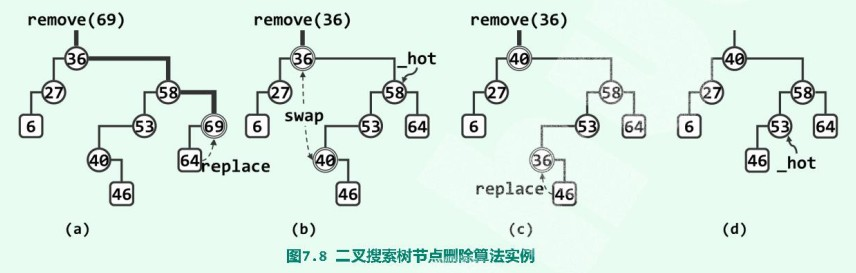
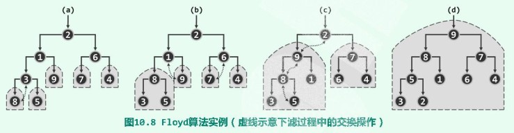
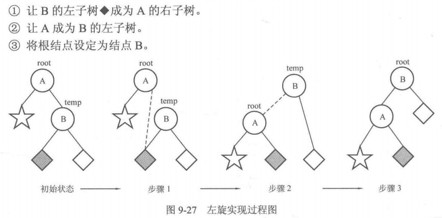
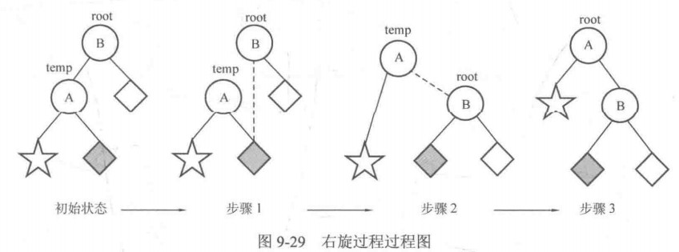
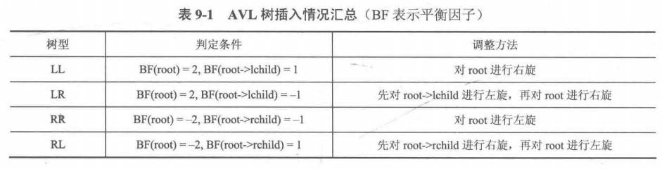

<div align='center' ><font size='6'><b>算法笔记</b></font></div>

[TOC]

## 一、基础知识

### 1. 字符串读入与存储问题

[参考文献](https://blog.csdn.net/ksws0292756/article/details/79432329)

#### 1.1 C风格字符串

* 字符串实际上是使用 null 字符 ‘\0’ 终止的一维字符数组

* 初始化方式：```char arr[] = "Hello";``` 或 ``` const char* arr2 = "Hello";```

* 两种初始化方式区别

  * arr是一个指向char变量的指针，arr2则是一个char字符数组

  * arr是一个char型指针变量，其值（指向的地址）可以改变；因此为了让其不可变，初始化应加const；如果不加const，应该 ```char arr3[] = "Hello"; char* arr2 = arr3;```
  * arr2是一个char型数组的名字，也是该数组首元素的地址，是常量，其值不可以改变

* #include<cstring>中有大量字符串处理相关函数，详见参考文献

* 使用该风格，**读入字符串时推荐使用 scanf,cin>>, cin.getline()，逐个读入时推荐使用getchar()**

#### 1.2 C++ 中的 String 类

* 必须包含头文件#include<string>（注意string和cstring不是同一个文件，string.h和cstring是同一个文件）

* 初始化方式：```string = "Hello";```

* string类**读入字符串时推荐使用 cin>>, getline()，逐个读入时推荐使用getchar()；输出只能用cout<<**


* string中内容的访问

  * 可以直接像数组那样通过下表访问

  * 通过迭代器访问

    ```C++
    string::iterator it = str.begin();
    cout<< *it//用*it对元素进行访问
    ```

* string类中常用方法

```c++
//字符串的拼接
str3 = str1 + str2;
str1 += str2; //str2拼接到str1的末端
str4 = "hello"+"world";//错误，常量不可相加
//字典序比较
if (str1 > str2) //可用==、!=、>=等
//获取字符串长度
str.length();
//对字符串进行修改
str.insert(pos,string);//pos为位置编号str[pos]
str.insert(it,it2,it3);//it为原字符串欲插入位置迭代器，it2和it3是待插字符串的首尾迭代器
str.erase(it);
str.erase(first,last);//first,last均为迭代器
str.erase(pos,length);
//查找替换子串
str.substr(pos,length);//返回从pos号位开始，长度为length的子串
str.find(str2);//如果str2是str的子串，返回第一次出现的位置；如果不是，返回-1
str.find(str2,pos);//从pos号位开始查找
str.replace(pos,len,str2);//pos~pos+len位置替换成str2
str.replace(it1,it2,str2);//迭代器写法
```
#### 1.3 两种风格的相互转换

```C
//string类型转char[]类型
for (int i = 0; i < str.length(); i++) 
	arrc[i]=str[i];
//char[]类型转string类型
char arr[] = "Hello";
string s = arr;
```

#### 1.4 字符串的读入方式

> scanf("<格式化字符串>"，<地址表>);
* 从缓冲区里边取数据边读到对应的变量里
* %c格式可以读入空格符和回车符，因此使用%c进行单个字符读入时要特别注意缓冲区重回车符的残留，此时不建议使用scanf，建议使用getchar
* 遇到空格和回车停止从缓冲区读入字符
* 注意什么时候加&，什么时候不加

　char str[100];中的str本身就是地址，不用加，其它情况都要加

* 可充分利用格式化字符串进行输入匹配的优势，如下示例：
```C++
/*数据输入形式如下：
Tom 10000000 100 A
Richard 10000001 98 A
Mary 10000002 99 A
要将他们分别存入结构体的三个属性中*/
typedef struct{
	char name[100];
	char number[100];
	int score;
}student;
int main(){
	student s[10];
	for(int i=0;i<3;i++)
		scanf("%s %s %d",s[i].name,s[i].number,&s[i].score);
	for(int i=0;i<3;i++)
		printf("%s %s %d\n",s[i].name,s[i].number,s[i].score);
	return 0;
}
//注意：两个%d之间可以不加空格
```

> getline(cin,string)

* string必须是C++中的string类
* 遇到回车符，结束字符串输入
* 丢弃回车符（不保存在缓冲队列里）

> getchar()

* 逐个读入字符，包括回车符

>  cin>>储存输入行的数组名称

* 遇到空格符、回车符，结束字符串输入
* 保留剩下字符在缓冲队列中
* 自动在结尾添加\0字符

>getchar()和cin>>的对比

* 如果程序需要回车符，那么用getchar方便书写代码
* 如果程序不需要回车符或空格，那么用cin比较方便
```C++
#include<iostream>
using namespace std;
int main(){
//消除输入字符串中空格和回车的方法，若输入为 i am a stu，按回车，以ctrl+z结束
	char ch;
	string s;
	while(cin>>ch){
		s += ch;
	}
	cout<<s;//输出为 iamastu

//此处getchar()吃掉了回车符并中断while循环
	char ch;
	string s;
	while((ch=getchar())!='\n' && ch != 'EOF' ) s += ch;
	cout<<s;//输出为 i am a stu
	return 0;
}
```

> cin.getline(储存输入行的数组名称, 要读取的字符数, ‘中断符默认\n’)

* 遇到回车符，结束字符串输入
* 丢弃回车符（不保存在缓冲队列里）
* 要读入的字符数 = 实际字符数+1 （最后一位是\n）
* cin.get() 保留回车符在缓冲队列中，尽量避免使用

#### 1.5 总结

* **如有使用scanf匹配的需求，使用C语言风格并用scanf读入，然后转成string类型；**

* **如有逐个读入字符的需求，使用string类并用getchar读入；**

* **除此之外，推荐使用string类并用getline读入**


### 2. 结构体struct与类class

* 结构体的定义

```C++
typedef struct Node{
    char name[20];
    int score;
    char grade;
    Node* point;//Node*型指针变量
}left,right,node[100];
```

* 结构体的内元素的访问

  * .操作
  * ->操作

  结构体变量和结构体指针变量内的元素访问本质是一样的，即.操作；->操作是对于结构体指针变量内元素访问的简便解法

  ```C
  Node stu, *p;
  stu.name;
  (*p).name;//等价于下面一种写法
  p->name;
  ```

* 结构体初始化

```C
typedef struct Node{
    int score;
    char grade;
    Node(){}//如果自己定义了构造函数，就不能不经初始化就定义结构体变量，因此要加上原有的默认构造函数
    Node(int sscore,char sgrade){
		score = sscore;
        grade = sgrade;
    }
    //或者简写成：
    //Node(int sscore,char sgrade):score(sscore),grade(sgrade){}
}stu;
stu = Node(99,'A');
```

* 类class的使用

```C++
class Node{
	public:
	    int score;
	    char grade;
	public:
	    Node() {}
	    ~Node() {}
	    Node(int sscore,char sgrade){
	    	this->score = sscore;
	    	this->grade = sgrade;
		}
	    void setScore(int sscore){
	        this->score = sscore;
	    }
	    int getScore(){
	        return this->score;
	    }
};
```

* struct和class的联系和区别
  * struct和class中都可以声明或定义属性和方法
  * 默认权限不同（struct-public, class-private）
  * 是否可用于声明模板（struct不可以， class可以）


### 3. 函数与参数传递、指针与引用

* 数组作为参数时，第一维不需要填写长度，第二维需要；无论一维二维，实际调用时只需要填写数组名
* 数组作为参数时，在函数中对数组元素的修改就等同于对原数组元素的修改，这一点不同于局部变量
* 数组只能作为函数的参数，但不能作为返回值；如果要想返回数组，可按照下列方式往函数中传入数组

```C++
void change(int a[],int n,int b[][5]){
	for(int i=0;i<n/5;i++){
        for(int j=0;j<5;j++){
            b[i][j] = a[k++];
        }
    }
}
```

* 指针可简单理解为变量的地址，是一个无符号整数
* 指针变量用来存放指针（地址）。例如int * p的含义是p是int型的指针变量，p指向的（储存的）地址用来存放int型变量；因此进行赋值```int a; int* p = &a;```时是将地址&a赋值给p。形象化地理解：p是房间，*p是打开房间的钥匙，从而获取房间里面的元素
* 对于int型指针变量p（即```int* p```），p+1指下一个int型变量地址（跨越了一个int，即4Byte）。该点常用于访问数组元素，如```int a[10]; int* p = a; cout<<*(p+3);```
* 指针变量作为函数参数时，传入的是地址的副本，因此可以用来写swap函数

```C++
void swap(int* a,int* b){
	int temp = *a;
    *a = *b;
    *b = temp;
}
```

* 引用并没有对变量地址取副本，而是对原变量取了一个别名，对引用变量的操作即对原变量的操作

* 引用并不是取地址的意思，常量不可以使用引用

  ```C++
  void swap(int* &p1,int* &p2){}//指针变量的引用
  int* p1 = &a;//p1是指针变量，&a是地址常量（无符号整数）
  swap(p1,p2);//正确
  swap(&a,&b);//不正确
  ```

* 引用示例

```C++
void change(int &x){
	x = 1;
}
int a = 10;
change(a);//不管是否使用引用，函数的参数名和实际传入的参数名可以不同
```


### 4. C++ STL

#### 4.1 \<vector\>

* 用途：使用邻接表存储图

* vector本质为变长数组，包含在头文件 #include\<vector\>

* 定义与初始化

  ```C++
  vector<typename> name;
  vector<typename> arr[100];//arr[0]~arr[99]中每一个都是一个vector容器
  vector<vector<int> >;//注意中间的空格
  vector<int>a(b.begin(),b.begin()+3); //初始化
  ```

* 容器内元素的访问

  ```C++
  //直接访问
  vector<int> v;
  v[index];//注意：只能索引vector中已经存在的下标，因此不能这样赋值：
  //vector<int>v; v[0] = 3;
  
  //迭代器访问
  vector<int>::iterator it = v.begin();//定义迭代器（类似于指针）
  *it;
  /*迭代器有关注意点
  1. v.end()是尾元素地址的下一个地址，不存储任何元素
  2. 不支持it < v.end();只能写it != v.end();
  3. 只有在vector和string中，才能用迭代器+整数，其余必须用advance(it,-5)的形式且包含头文件#include<iterator> 或使用 it++
  */
  ```

* 常用函数

  ```C++
  vector<int> v;
  v.push_back(x); //在末尾插入元素x
  v.pop_back(); //删除尾元素
  v.size(); //容器内元素个数
  v.insert(it,x); //在迭代器it处插入x
  v.erase(it);
  v.erase(it_first,it_last);//删除[it_first,it_last)内的所有元素
  ```

#### 4.2 \<set\>

* 特点：内部有序（自动递增）、元素不重复

* 常用函数

  ```C++
  #include<set>
  set<int> s;
  s.insert(value);
  set<int>::iterator it = s.find(value);
  s.erase(s.find(100));
  s.erase(value);
  s.erase(it_first,it_last);
  ```

#### 4.3 \<map\>

* 特点：映射，以键从小到大排序，键和值唯一

  ```C++
  #include<map>
  map<string,int> mp;//必须用string，不能用char数组
  //映射前称为键key，映射后称为值value
  mp["sa"];//通过键访问，返回值（int整数）
  it->first;it->second;//通过迭代器访问
  mp.find(key);
  mp.erase(it);
  mp.erase(key);
  ```

#### 4.4 \<pair\>

* 特点：二元结构体，方便比较（先比较第一个，再比较第二个）

  ```C++
  #include<map>
  pair<string,int> p;
  ```

#### 4.5 <algorithm\>

```C++
max(x,max(y,z));//x可为浮点数
abs(x);//x为整数
fabs(x);//x为浮点数，在math头文件下
swap(x,y);
reverse(it,it2);//数组元素反转
fill(a,a+5,123);//给数组赋值
```


### 5. 一些小技巧

* 定义无穷：```const int INF = 0X3fffffff; //可以避免相加超过int的情况```
* 对数组中每一个元素初始化为0：```memset(数组名,0,sizeof(数组名))```

 

## 二、经典问题

### 1. 排序、散列(hash)、二分查找

* 各排序总结见内排序算法总结.docx；下面是思路总结
  * 插入排序：从第2个元素开始，将该元素和它前面相邻的元素做大小比较，如果小于前面那个元素，就交换位置
  * 冒泡排序：每一轮比较相邻的元素，如果第一个比第二个大，就交换他们两个；直到没有任何一对元素需要交换
  * 选择排序：不断从无序序列中选择最小的一个元素，和第一个元素交换；然后将该元素放入有序队列中
  * 希尔排序shell_sort：每次将具有相同间隔的数分为一组，对每一组进行插入排序；间隔依次递减，直到1为止
  * 归并排序：
    * 分解操作：将原始序列从中间分为左、右两个子序列，然后对子序列执行相同的操作，直到每个子序列只有1个元素；
    * 合并操作：在合并两个子序列过程中，将较小的元素放在左边；如果两个元素相等，将左边子序列的元素放在新序列的左侧以保证稳定性
  * 带有threshold的归并排序：当子序列的元素个数小于threshold时，调用快速排序
  * 快速排序：【实质上就是选取一个pivot，将比pivot小的元素放在它的左侧，比它大的元素放在它的右侧；然后对左右侧子序列递归地进行上述过程】
    * 选取任意元素为pivot，其数组下标为index
    * 交换index所指元素和最右侧元素的位置
    * 左侧指针从左往右扫描，找到第一个比pivot大的元素
    * 右侧指针从右往左扫描，找到第一个比pivot小的元素
    * 交换左右指针两个元素
    * 重复步骤2~4，直到两个指针相遇（相遇点为brkp），交换pivot（最右侧元素）和brkp所指的元素
    * 分别对brkp左侧序列（都比pivot小）和右侧序列（都比pivot大）递归进行快速排序
  * 堆排序：把要排序的数组转化为最大堆；然后选择堆顶元素，并删去重新建堆
  * 桶排序：把区间 [minV, maxV] 均匀划分成 k 个区间，每个区间就是一个桶；桶内选择任意一种排序算法；然后再合并桶
  * 基数排序：从数的最低位开始，依次进行一次**稳定排序**
* 下面介绍C++ STL排序

```cpp
#include<algorithm>
sort(首元素地址（必填),尾元素地址的下一个地址（必填）,比较函数（非必填，默认递增）);
//比较函数cmp的实现
//基本数据类型从大到小降序排序
bool cmp(int a,int b){
    return a > b;
}
//结构体数组的排序
bool cmp(Node a,Node b){
	return a.x > b.x; //降序
}
//容器的排序，只有vector/string/deque可以用sort
bool cmp(string str1, string str2){
    return str1.length() < str2.length();
}
sort(str,str+3,cmp);
```


* 散列的核心思想是以空间换时间（详见《王道》、文件夹中的代码）；排序算法中基数排序和桶排序就是散列的思想
* 有一些较基础的查找题（不涉及到后面的搜索问题）都是 排序（快排sort）+二分查找


### 2. 双指针法/滑动窗口法

### 3. 日期类问题

* 判断两个日期的差
  * 思路：从dstart开始，一天一天数到dend，注意判断是否为闰年（年数能被4整除且不能被100整除，或者能被400整除）
  * 例题：[牛客网-日期差值](https://www.nowcoder.com/practice/ccb7383c76fc48d2bbc27a2a6319631c?tpId=40&&tqId=21442&rp=1&ru=/ta/kaoyan&qru=/ta/kaoyan/question-ranking)
* 判断今天星期几
  * 思路：在判断了两个日期之差的基础上，模7
  * 例题：[牛客网-day of week](https://www.nowcoder.com/practice/a3417270d1c0421587a60b93cdacbca0?tpId=40&&tqId=21439&rp=1&ru=/ta/kaoyan&qru=/ta/kaoyan/question-ranking)


### 4. 贪心问题

当问题明显能通过局部最优得到整体最优时，使用贪心算法

### 5. 排版

### 6. 0-1背包问题

见算法设计课程报告

## 三、数学问题

### 1. %运算、数位拆解、进制转换

* 计算机模运算步骤：计算a的绝对值除以b的绝对值的余数；然后使该余数的符号与a的符号一致
  $$
  a\%b == a\%(-b)\\
  3\%2 == 3\%(-2) == 1\\
  (-3)\%2 == -1
  $$

* 计算机中模运算规律
  $$
  (a*b)\%c=((a\%c)*(b\%c))\%c\\
  (a+b)\%c=(a\%c+b\%c)\%c
  $$
  
* 数论中的模运算的结果为[0,b-1]，即不可能出现负数

* 实际问题中为了与数论中的结果保持一致，可以$a\%b == (a+b)\%b$

* 如何求一个数的个位、十位...？记住下面两个原则

  * 将一个数模10，则求出该数的个位
  * 将一个数除以10，则该数的第n位就变成第n-1位【因此，求一个数的十位就是除以10，然后模10】
  * 【另一种方法】拆分数位方法2：将数当作字符串处理

* 十进制如何转化为m进制

  * 同上：不断将一个数模m，再除以m，求得各个数位
  * 【m进制如何转化为十进制？乘以每一位的权重即可】

### 2. 最大公约数GCD、最小公倍数LCM

* 求最大公约数的算法：欧几里得算法（辗转相除法）

  * 原理：$gcd(a,b)=gcd(b,a \% b)$（b不等于0）

  * 举例

    ```
    1997 / 615 = 3 (余 152)
    615 / 152 = 4(余7)
    152 / 7 = 21(余5)
    7 / 5 = 1 (余2)
    5 / 2 = 2 (余1)
    2 / 1 = 2 (余0)
    至此，最大公约数为1
    以除数和余数反复做除法运算，当余数为 0 时，取当前算式除数为最大公约数
    ```

* 最小公倍数 = 两数乘积 除以 最大公约数 = a*b/gcd(a,b)

### 3. 素数、分解素因数

* 素数的定义：只能被自身和1整除的大于1的正整数
* 判断一个数n是否为素数：判断这个数是否能被2到sqrt(n)中的某个数整除【时间复杂度o(sqrt(n))】
* 找出指定范围内的素数：筛数法
  * 原理如下：如果一个数不是素数，那么一定存在素因数，且这个素因数为小于这个数；
  * 筛数法步骤如下：在获得一个素数时，将它的所有k倍数(k>=i)标记为非素数【为什么不从2标？因为当k<2时，i*k同时也是k的倍数，在标记k的倍数时已经标记过了】【再注意：如果从2开始数起，可以从i开始标记；如果不是的话，得从2开始标记】
* 如何将一个数（规模为n）分解成多个素因数的乘积？步骤如下
  * 先用筛数法求出2到sqrt(n)的素数【注意不用求出sqrt(n)到n的素数，因为n至多存在一个大于sqrt(n)的因数】
  * 依次测试这些素数p能否整除n，若能则表明为n的一个素因数
  * 不断用n除以该素因数p，直到p不能整除n位置，求出该素因数p的幂指数b
  * 若n变为1，则终止
  * 若遍历完所有素数且n!=1，则说明存在一个大于sqrt(n)的素因数
* 如何对n!进行素因数分解？【注意n!可能超出long long表示范围】[牛客网-整除问题](https://www.nowcoder.com/practice/8e29045de1c84d349b43fdb123ab586a?tpId=40&&tqId=21436&rp=1&ru=/ta/kaoyan&qru=/ta/kaoyan/question-ranking)
  * 原则：n!表示从1到n的乘积，这些因子中有n/p个整数至少贡献了1个p因子；有n/(p*p)个整数至少贡献了2个p因子
  * 步骤
    * 先用筛数法求出2到n的素数
    * cnt = 0
    * 不断计算$n/(p^i)$，直到$n/(p^i)=0$ 表示1到n中没有一个整数能向n!提供i个及以上的p因子；
    * cnt += $n/(p^i)$
    * 至此关于n!的p分解结束，cnt即为幂指数
    * 重复2到5步讨论下一个素数p

### 4. 大整数运算

* 浮点数同理

* 存储格式

  ```cpp
  struct bignum{
  	int d[MAXN]; //存放大整数的每一位
  	int len; //位数
  	bignum(){ 
  		memset(d,0,sizeof(d));
  		len = 0;
  	}
  	bignum(char *t){ //将字符串转化成结构体中的数组，并计算大整数位数
  		len = strlen(t);
  		for(int i=len-1;i>=0;i--)  //将高位放在后面，方便后面进位的处理
  			d[len-i-1] = t[i] - '0';
  	}
  };
  ```

* 大整数加法：从低位开始，各对应位相加，并加上来自低位的进位

* 大整数减法：从低位开始，各对应位相减，并减去来自低位的进位

* 大整数乘以int：类似于大整数加法

* 大整数除以int：

* 大整数模int：

* 大整数排序：可转化为字符串排序

* 大整数乘以大整数【逐位乘再相加】、大整数除法【不断相减】作了解内容（见平时练习）


## 四、数据结构的增删改查

### 1. 队列

```C++
#include<queue>
queue<int> q;
q.front();//访问队首元素
q.back();//访问队尾元素
q.push(x);//入队（插入队尾）
q.pop();//出队（删除队首元素）
q.empty();//empty-->true
q.size();
while(!q.empty()){
	q.pop();
}//清空clear
//双端队列（首尾都可插入删除）
deque<int> dq;
```

### 2. 堆栈

* 注意：堆栈就是栈stack；堆是另一种数据结构heap

```C++
#include<stack>
stack<int> s;
s.push(x);
s.pop();
s.empty();
s.size();
```
* 栈的应用
  
  * 括号匹配问题
  
  * 表达式的求值（只有加减乘除、多位整数），算法步骤如下
  
    【理解：处理结束的标志是：符号栈只剩下自定义的两个特殊字符；数值栈只剩下一个元素即结果】
  
    * 建立数值栈、符号栈；读入字符串，并在后面加'='（自定义的特殊字符）
    * 将'$'（自定义特殊字符）压入符号栈
    * 定义优先级$ < = < +- < */
    * 处理字符串：
      * 如果遇到数字字符，不断读入，直到遇到符号字符停止，然后转化为数值存入数值栈
      * 如果遇到符号字符，比较当前符号字符cur和符号栈栈顶字符top的优先级
        * 如果cur<=top，取出数值栈栈顶两个元素进行运算，将结果存入数值栈，然后将当前运算符放入符号栈；重复该步骤，直到cur>top
        * 如果cur>top，把当前字符放入符号栈
  
  * 【课程设计】带括号表达式的求值（有各种运算、负号、小数等）【见[博客](https://www.cnblogs.com/icodes8238/p/12243275.html)、文件夹里面的两个pdf文件】

### 3. 链表

博客地址：[队列、栈、链表（STL）](https://www.cnblogs.com/icodes8238/p/12255222.html)

#### 3.1 手写动态链表

代码思路：

* 创建链表Creat()：创建头结点-->创建前驱结点指向头结点-->创建新的当前节点并赋值-->前驱结点的指针域指向当前结点-->前驱结点指针指向当前结点
* 查找Search()：从头结点的指针域出发-->比对当前结点的值-->更新当前结点的指针域
* 插入Insert()：从头结点的指针域出发-->定位到要插入位置的前一位置-->创建新结点-->新结点指针域指向下一结点-->前驱结点的指针域指向新结点
* 删除Delete()：从头结点的指针域出发-->比对当前结点的值-->当前结点的前驱结点指向当前结点的下一结点

代码实现：参考《算法笔记》_胡凡 P253实现

```Cpp
//-----------有头结点单向链表搭建（头插法）20200806-------------------
#include<iostream>
using namespace std;
//链表的结点有两部分构成：数据域和指针域
typedef struct Node{
    int value;
    struct Node *next;
}Node;

Node* Creat(int arr[],int n){ //创建单向链表，返回头结点指针 
	//创建头结点 
    Node* head = new Node; //new+类型名 申请动态内存空间 
    head->value = -1;
    head->next = NULL;
    Node *pre = head;//复制指向头结点的指针，pre的作用是指向当前节点的前驱结点 
    for(int i=0;i<n;i++){
    	//根据arr数组创建结点
        Node *t = new Node;
        t->value = arr[i];
        t->next = NULL; 
        //更新pre结点 
        pre->next = t;//当前结点的前驱结点的指针域指向当前结点 
        pre = pre->next;//当前结点为下一结点的前驱结点 
    } //执行到这里到了最后一个结点pre->next为NULL
    return head;//返回头结点指针 
} 
Node* Search(Node* head,int x){ //查找链表中指定的值，返回指向该值所在结点的指针 
	Node* p = head->next; //从第一个结点开始
	while(p != NULL){
		if(p->value == x){
			break;
		}
		p = p->next;
	} 
	return p;
}
Node* Insert(Node* head,int pos,int x){ //将值为x的结点插入第pos个位置，返回插入节点指针 
	//定位到第pos个位置 
	Node* p = head; 
	for(int i=0;i<pos-1;i++){ //定位到pos的前一个位置 
		p = p->next;
	}
	//新建结点 
	Node* np = new Node;
	np->value = x;
	np->next = p->next;
	p->next = np; 
	return np;
}
Node* Delete(Node* head,int x){ //删除链表中第一个值为x的结点，返回下一结点指针
	Node* p = head->next;
	Node* pre = head;
	//定位到要删除的结点 
	while(p){
		if(p->value == x){
			pre->next = p->next;
			delete(p); //指针变量p本身并没有消失，p指向了NULL（不一定），但p指向的内存释放了 
			p = pre->next; 
			break;
		}
		pre = p;
		p = p->next;
	} 
	return p;
}
void show(Node* head){
	Node* p = head->next;
	while(p){
		printf("%d ",p->value);
		p = p->next;
	}
	cout<<endl;
}
/*//注意C语言中malloc申请动态内存也应该掌握 
	#include<stdlib.h>  //malloc函数
	Node *head = (Node*)malloc(sizeof(Node));
	//即 typename* p = (typename*)malloc(sizeof(typename)); 
	//返回指向这块空间（申请的空间）的指针 
*/
```

#### 3.2 C++ STL

```cpp
#include<list>
list<int> li;
li.insert(iterator, x); //在list迭代器位置插入x
li.push_front(x);
li.push_back(x); //尾部插入一个数值
li.pop_back();
li.pop_front();//删除尾部
li.erase(iterator);//删除迭代器iterator指向的元素
li.remove(x);  //删除一个value  = x
li.empty();//empty-->true
li.size();
li.sort();//list中的函数sort，从小到大排序
li.reverse();//将list中的元素倒序
li.merge(lint4);  //有序（升序）合并，会释放掉lint4
li.splice(lint2.begin(), lint3);//将整个lint3拼接在lint2.begin()， 并free lint3
li.unique();//去重
```

#### 3.3静态链表

```Cpp
//静态链表即用结构体数组模拟链表
typedef struct Node{
    int value; //模拟数据域
    int next; //模拟指针域，相当于链表中结点地址，实际上是数组下标
}node[size];
```


### 4. 优先队列（堆）

#### 4.1 C++ STL

* 常用函数

```C++
#include<queue>
priority_queue<int> q;
q.push(x);
q.top();//使用top前，一定用empty判断是否为空
q.pop();
q.empty();
q.size();
```

* 优先级的设置问题

```C++
//1.对于double,int,char型默认最大堆，即下列等价
priority_queue<int> q;
priority_queue<int, vector<int>,less<int> > q;
//第二个参数是承载底层数据结构堆的容器，第三个参数是对第一个参数的比较类
//第三个参数中，less<int>表示从大到小，greater<int>表示从小到大

//2.对于结构体，需要重载操作符<
//---------方式1（放在结构体里面，推荐）-----------
struct fruit{
    string name;
    int price;
    friend bool operator < (const fruit &f1,const fruit &f2){ //使用引用提高效率
		return f1.price < f2.price;
    }
}
priority_queue<fruit> q;//此时吧价格低的放在队首
//--------方式2（放在结构体外）-----------
struct cmp{
	bool operator()(fruit f1,fruit f2){
		return f1.price > f2.price;
    }
}
priority_queue<fruit,vector<fruit>,cmp> q;//此时吧价格低的放在队首
```

#### 4.2 手写优先级队列

见5.4 满二叉树的静态写法与堆（优先队列）

### 5. 树

树的定义：没有简单回路的连通图 <==> 任何两个结点之间路径只有一条

树的易混概念

* 结点的深度：根节点到该结点路径的长度，等于该结点所在层数；根节点深度为0
* 树的高度：最深结点深度 + 1
* 满二叉树(full)：每个结点或是 恰好有两个非空子结点的分支结点，或是 叶节点
* 完全二叉树(complete)：从根节点起每一层从左到右填充，除了底层叶结点外，每一层都是满的

#### 5.1 二叉树

* 二叉树的查找、插入、建立、删除和二叉搜索树的类似，在此不赘述
* 二叉树的遍历

```Cpp
//遍历的中先后指的是访问数值域的顺序，注意访问左子树永远在访问右子树的前面
void InOrder(BSTNode *T){ //中序遍历，左中右
	if(T!=NULL){
	    InOrder(T->left);
	    cout<<T->value<<" ";
	    InOrder(T->right);
	}
}
void PreOrder(BSTNode *T){ //先序遍历，中左右
    if(T){
        cout<<T->value<<" ";
        PreOrder(T->left);
        PreOrder(T->right);
    }
}

void PostOrder(BSTNode *T){ //后序遍历，左右中
    if(T!=NULL){
	    PostOrder(T->left);
	    PostOrder(T->right);
	    cout<<T->value<<" ";
	}
}
```

* 根据前序遍历、中序遍历求后序遍历【牛客网】


#### 5.2 BST（二叉搜索树）

* 二叉搜索树的特点：左子树上所有结点的数据域均小于根结点的数据域（等于放在右子树）

* 难点在于BST结点的删除

  以图7.8为例，BST结点的删除分为单分支(a)和双分支(b)两种情况

  * 单分支：要删除的结点只有一个子结点 或 子结点都不存在
    * 方法：找到要删除结点p的位置，用结点p的子结点替代p，然后删除p的子结点
  * 双分支：要删除的结点有两个子结点
    * 直接后继的定义：中序遍历中，在遍历到当前结点之后，遍历到的下一个结点，该结点必无左孩子；或者说：要删除结点的右子树的最左边的结点
    * 方法：找到要删除结点p的直接后继，用直接后继结点替换p，转换成单分支的情况



* 代码实现：（博客地址：[BST 二叉搜索树](https://www.cnblogs.com/icodes8238/p/12292465.html)）

```Cpp
//------BST的查找、插入、建立、删除----
//------------20200806----------- 
#include<iostream>
using namespace std;
struct Node{
	int value;
	struct Node *left;
	struct Node *right;
}; 
Node* newNode(int v){ //创建一个新结点，返回指向新结点的指针（新结点的地址） 
	Node* node = new Node;
	node->value = v;
	node->left = NULL;
	node->right = NULL;
	return node;
}
Node* Search(Node* root,int x){ //从根结点开始，查找值为x的结点，返回指向该结点的指针 
	if(root == NULL){ //判断是否为空树 
		return NULL; 
	}
	if(root->value == x){
		return root; //唯一的返回值 
	}else if(x < root->value){
		Search(root->left,x);
	}else{
		Search(root->right,x);
	}
}
void Insert(Node* &root,int x){ //返回指向新插入结点的指针 
//由于要对树进行修改，所以必须加引用& 
	if(root == NULL){ //是空树，创建根结点 
		root = newNode(x);
		return ;
	}
	if(x < root->value){
		Insert(root->left,x);
	}
	if(x >= root->value){
		Insert(root->right,x);
	}
}
Node* Creat(int data[],int n){ //返回BST的根结点 
	Node* root = NULL;
	for(int i=0;i<n;i++){
		Insert(root,data[i]);
	}
	return root;
} 
Node* succ(Node *p){
	p = p->right;
	while(p->left != NULL){
		p = p->left;
	}
	return p;
}
Node* findParent(Node* root,Node *m){ //也可以通过记录父结点避免查找父结点
	Node *c = root;
	while(1){
		if((c->left!=NULL && m == c->left) || (c->right!=NULL && m == c->right)){//解决了结点关键码相等的问题 
			return c;
		}else if(m->value < c->value && c->left!=NULL){
			c = c->left;	
		}else if(m->value >= c->value && c->right!=NULL){
			c = c->right;	
		}else return NULL;
	}
} 
void Delete(Node* &root,int x){
	Node* p = Search(root,x);
	if(p->left && p->right){ //左子树右子树均不为空 
		Node* s = succ(p);
		p->value = s->value;
		p = s;
	}// 没有return
	//上面处理完双分支的情况，下面处理单分支的情况 
	if(p->left && !p->right){
		p->value = p->left->value;
		delete(p->left);
		p->left = NULL; //delete(p->left)以后 (p->left)不一定指向NULL!!! 
		return ;
	}
	if(p->right && !p->left){
		p->value = p->right->value;
		delete(p->right);
		p->right = NULL;
		return ;
	}
	if(!p->left && !p->right){
		Node* pre = findParent(root,p);
		if(pre->left == p) pre->left = NULL;
		if(pre->right == p) pre->right = NULL;
		delete(p);
		return ;
	}
}
```

* 二叉搜索树的遍历同二叉树，在此不赘述

 #### 5.3 树

* 树静态写法之存储结构（应用实例：博客地址：[树的静态写法](https://www.cnblogs.com/icodes8238/p/12294687.html)）

```Cpp
typedef struct Node{
    int data; //数据域
    vector<int> child; //指针域，存放所有子结点的下标
}node[MAXN];
```

#### 5.4 完全二叉树的静态写法、堆（优先队列）、Huffman编码树

* 完全二叉树的静态写法：用数组存储
  * 对所有结点按从上到下、从左到右的顺序编号
  * parent(v) = floor((v-1)/2) > 0 ?  floor((v-1)/2) : -1
  * leftchild(v) = 2*v+1
  * rightchild(v) = 2*v+2
  * 最后一个内结点lastinternal(n) = ceil((n-1)/2)

```cpp
int parenti(int v){//传入的都是下标 
	int t = floor((v-1)/2);
	if(t>=0) return t;
	else return -1;
}
int lefti(int v){
	return 2*v+1;
}
int righti(int v){
	return 2*v+2;
}
int lastinternal(){
	return ceil((n-1)/2);
}
```

* 上滤和下滤操作
  * 上滤：不断比较结点cur与其父结点p的关系-->若cur>p，则交换cur和p；若cur<=p，则堆序性保持，故不交换
  * 下滤：不断比较结点cur与其两个孩子结点中最大的那个孩子结点maxchild的关系-->若cur<maxchild，则交换cur和maxchild；若cur>=maxchild，则堆序性保持，故不交换

```cpp
void percolateUp(int index){
	while(data[index] > data[parenti(index)]){
		Swap(data[parenti(index)],data[index]);
		index = parenti(index);
	}
}
void percolateDown(int index){
	while((data[index] < data[lefti(index)])||(data[index] < data[righti(index)])){
		if(data[lefti(index)]>data[righti(index)]){
			Swap(data[lefti(index)],data[index]);
			index = lefti(index);
		} else {
			Swap(data[index],data[righti(index)]);
			index = righti(index);
		}
	}
}
```

* 最大堆的定义：最大堆是一棵每一个节点的键值都不小于其孩子（如果存在）的键值的完全二叉树。

* 堆的插入、删除、建立、查找

  * 插入：将结点np放到到堆的末尾-->从结点np开始上滤

  * 删除堆顶：用最后一个元素代替堆顶元素-->删掉最后一个元素-->从堆顶开始下滤

  * 建堆：（Floyd算法 ）：从最后一个内部结点开始-->从后往前对每一个内部结点下滤

    

  * 查找：返回堆顶元素

```cpp
#include<iostream>
#include<math.h>

using namespace std;
int data[100];
int n ;

void Swap(int& ,int& );
int lastinternal();
bool Inheap(int );//判断是否为内部结点 
int parenti(int );
int lefti(int );
int righti(int );
int getmax();
void Insert(int );
void deleMax();
void buildheap();
void percolateUp(int );
void percolateDown(int );

void Swap(int &a,int &b){
	int t = a; a = b; b = t;
}
bool Inheap(int index){
	if(data[lefti(index)]<n); //在完全二叉树结构中，如果一个结点的左孩子存在（在堆里面），那么它为内部结点
}
int getmax(){
	return data[0];
}
void Insert(int v){//percolateUp 
	int index = n;
	data[index] = v;
	percolateUp(index);
	n++;
}
void deleMax(){//percolateDown
	data[0] = data[n-1];//注意n-1 
	n--;//用最后一个元素代替堆顶元素，然后下滤
	int index = 0;
	percolateDown(index);
}
void buildheap(){//Floyd算法 
	for(int i =lastinternal();i>=0;i--){
		if(Inheap(i)) 
			percolateDown(i);
	}
}
```

* Huffman编码树
  * Huffman编码树构建思想：反复选择两个最小的元素，合并，直到只剩下一个元素
  * Huffman编码是能使给定字符串编码成01串后长度最短的前缀编码
  * 前缀编码：任何一个字符的编码都不是另一个字符的编码的前缀
  * 代码实现：博客地址：[Huffman Code Tree](https://www.cnblogs.com/icodes8238/p/12292890.html)
  * 应用：牛客网

#### 5.5 AVL（平衡二叉树）

* AVL树基础知识

  * 理想平衡：完全二叉树（叶节点只能出现在底部两层）

  * 适度平衡：将树高限制为“渐进地不超高O（logn）”，如AVL树、伸展树(The Splay Tree)、红黑树、kd-树

    他们都属于平衡二叉搜索树(Balanced binary search tree, BBST)

  * 某一结点平衡因子定义：该结点左右子树的高度差

  * A balanced Binary Search Tree, for every node in which, **the heights of its left and right subtrees differ by at most 1**

  ```cpp
  struct node{
      int data; //结点的数据域
      int height; //以当前结点为根结点的子树的高度
      node* left; 
      node* right;
  };
  node* newnode(int v){
      node* p = new node;
      p->data = v;
      p->height = 1; //结点高度初始为1，树的高度=最深结点（该结点）深度（0） + 1 
      p->left = NULL;
      p->right = NULL;
      return p;
  }
  int getHeight(node* root){
  	if(root == NULL) return 0; //空结点高度为0 
  	return root->height;
  }
  int getBalanceFactor(node* root){ //这里计算平衡因子并没有加绝对值，是为了记录左子树高还是右子树高 
  	if(root == NULL) return 0;
  	return getHeight(root->left) - getHeight(root->right);
  }
  void updateHeight(node* root){
  	root->height = max(getHeight(root->left) , getHeight(root->right)) + 1;
  }
  ```

  

* AVL树的Rebalance操作（也可参考DSAA笔记Advanced tress）

  * 左旋(left rotation/zag)

  

  ```cpp
  void leftrotation(node* &root){
  	node* temp = root->right; //root指向结点A，temp指向结点B
  	root->right = temp->left; //步骤1
  	temp->left = root; //步骤2
  	updateHeight(root); //更新结点A的高度
  	updateHeight(temp);//更新结点B的高度
  	root = temp; //步骤3
  }
  ```

  * 右旋(right rotation/zig)

  

  ```cpp
  void rightrotation(node* &root){
  	node* temp = root->left;//root指向结点B，temp指向结点A
  	root->left = temp->right;//步骤1
  	temp->right = root;//步骤2
  	updateHeight(root);//更新结点B的高度
  	updateHeight(temp);//更新结点A的高度
  	root = temp;//步骤3
  }
  ```

* AVL树结点的插入和删除操作

  * 结点插入操作只会导致该结点的祖先结点失衡
  * 结点删除操作只会导致一个祖先结点失衡，但在rebalance的时候可能会调整logn个结点，这种现象称为失衡传播，在这里不作代码实现

结点插入操作分为四种情况，总结如下：（分析见《算法笔记》P324）



```cpp
void insert(node* &root,int v){
	if(root == NULL){
		root = newnode(v);
		return ;
	}
	if(v >= root->data){ //v比根结点的权值大
		insert(root->right,v); //往右子树插
		updateHeight(root); //更新树高
		if(getBalanceFactor(root) == -2){
			if(getBalanceFactor(root->right) == -1) //RR
				leftrotation(root);
			else if(getBalanceFactor(root->right) == 1){ //RL
				rightrotation(root->right);
				leftrotation(root);
			}
		}
	}else if(v < root->data){
		insert(root->left,v);
		updateHeight(root);
		if(getBalanceFactor(root) == 2){
			if(getBalanceFactor(root->left) == 1) //LL
				rightrotation(root);
			else if(getBalanceFactor(root->left) == -1){ //LR
				leftrotation(root->left);
				rightrotation(root);
			}
		}	
	}
}
```


## 五、图论问题

### 1. 图的存储

* 邻接矩阵
  * 用二维数组G\[ ][ ]存储
  * G\[i][j]表示顶点i和j之间的边的权重，可设定该权重为0或-1表示这两点之间不存在边
  * 无向图的邻接矩阵是一个对称矩阵
  * 如果顶点数目较大，如1000以上，则用邻接表存储
* 邻接表

```cpp
struct Edge{
    int v; //v为该边的另外一个顶点
    int weight; //该边的边权 
};
vector<Edge> adj[MAXN]; //adj[i]存放从顶点i出发所有能到达的点 ；相当于二维数组
//如果没有权重，可以不定义结构体，直接vector<int> adj[MAXN];
```

### 2. 图的遍历（DFS,BFS）

博客地址：[DFS与BFS](https://www.cnblogs.com/icodes8238/p/12262225.html)

* DFS推荐递归实现

  ```cpp
  //邻接表版dfs递归实现
  vector<int> adj[MAXN];//图G的邻接表
  int n;//顶点数
  bool vis[MAXV]; //如果已经被访问，则置为true，初始值为false
  void DFS(int u,int depth){
  	vis[u] = true;
      for(int i=0;i<adj[u].size();i++){ //从u出发可以到达的所有结点
          int v = adj[u][i];
          if(vis[u] == false){
              DFS(v,depth+1);
          }
      }
  }
  //如果是多连通图
  void DFSTrave(){
  	for(int u=0;u<n;u++){
          if(vis[u] == false){
              DFS(u,1); //访问u和u所在的连通块
          }
      }
  }
  ```

* BFS推荐队列实现

  ```cpp
  //邻接表版bfs队列实现
  vector<int> adj[MAXN];//图G的邻接表
  int n;//顶点数
  bool inq[MAXV]; //如果曾经入过队列，则置为true，初始值为false
  void BFS(int u,int depth){
      queue<int> q;
      q.push(u);
  	inq[u] = true;
      while(!q.empty()){
          int u = q.front();
          q.pop();
          for(int i=0;i<adj[u].size();i++){ //从u出发可以到达的所有结点
              int v = adj[u][i];
              if(inq[u] == false){
                  q.push(v);
                  inq[v] = true;
              }
          }
      }
  }
  //如果是多连通图
  void DFSTrave(){
  	for(int u=0;u<n;u++){
          if(inq[u] == false){
              BFS(u); //访问u和u所在的连通块
          }
      }
  }
  ```

### 3. 最短路径问题

博客地址：[最短路径问题](https://www.cnblogs.com/icodes8238/p/12268566.html)

《算法笔记》P378

* Dijkstra （/ˈdɛɪkstra/ 迪杰斯特拉）算法 -->解决单元最短路问题，无负边权
* BF算法

### 4. 最小生成树问题、并查集

博客地址：[最小生成树与判断无向图是否有回路（并查集）](https://www.cnblogs.com/icodes8238/p/12244850.html)

### 5. 拓扑排序问题

博客地址：[拓扑排序与判断有向图是否有回路](https://www.cnblogs.com/icodes8238/p/12244762.html)

### 6. 最大网络流问题、最小费用流问题（关键路径？）


## 递归与分治法

参考：《算法笔记》P112~118笔记

博客地址：[递归与分治](https://www.cnblogs.com/icodes8238/p/12257161.html)

### 1. 如何理解递归？

* 不要想着“不停地调用函数”，应用**数学归纳法**的思想理解。

* 注意递归边界

* 寻找递归式（把问题分成若干的子问题，分而治之）
  * 比如Fibonacci数列，F(n)的两个子问题分别是F(n-1)，F(n-2)；
  * 再比如全排列问题，n位数全排列的子问题是n-1位数的全排列；
  * 而n皇后问题则是全排列问题的应用。

* 综上：写递归函数重点关注**递归调用过程**和**递归边界问题**

### 2. 分治问题的模板

分治法能解决问题的特点：能把问题分解为互不依赖的子问题

```cpp
divide-and-conquer(P){
　　if(|P|<=n0) { //解决小规模问题
　　　　adhoc(P); //直接求解P
　　　　return;
　　}
　　divide P into smaller subinstances P1,P2,...,Pk; //分解问题
　　for(int i = 1;i<=k;i++) yi = divide-and-conquer(Pi); //递归的解决各子问题
　　return merge(y1,....,yk); //将子问题的解合并成原问题的解
}
```


## 动态规划

博客地址：[从矩阵连乘计算次序问题引出动态规划](https://www.cnblogs.com/icodes8238/p/12666779.html)

能用动态规划解决问题的特点：能把问题分解为相互依赖的子问题


## 字符串处理问题


## 回溯法

博客地址：[回溯法](https://www.cnblogs.com/icodes8238/p/12893640.html)

* 基于递归的回溯法伪代码模板

```
void backtrack(int t){ //t为递归深度 
    if(t > n) output(x); //已经搜索到叶节点 
    else{
        for(int i=f(n,t); i<=g(n,t); i++){
            //f(n,t)、g(n,t)分别表示在当前扩展结点处未搜索过的子树的起始编号和终止编号
            x[t] = h(i);//h(i)表示当前扩展结点处x[t]的第i个可选值 
            if(constraint(t) && bound(t))
                backtrack(t+1);
        }
    }
}
```

## 分支限界法


## NP完全问题的近似算法


## 参考资料

* 《算法笔记》
* 《王道机试》
* 《剑指offer》
* 《啊哈算法》
* 牛客网https://www.nowcoder.com/
* 牛客网历年机试试题https://www.nowcoder.com/ta/kaoyan
* 百练http://bailian.openjudge.cn/contests/past
* 洛谷 https://www.luogu.com.cn/
* CCFCSP http://cspro.org/
* PAT https://pintia.cn/problem-sets?tab=0
* Leetcode https://leetcode-cn.com/